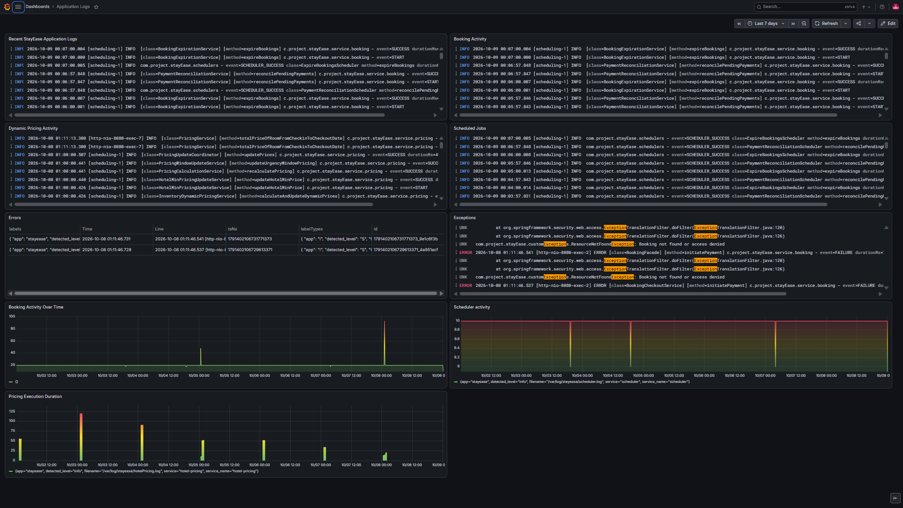
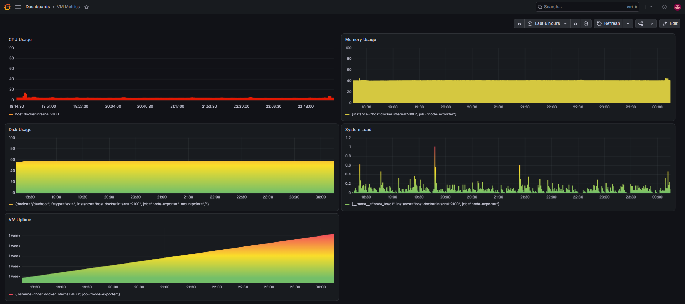
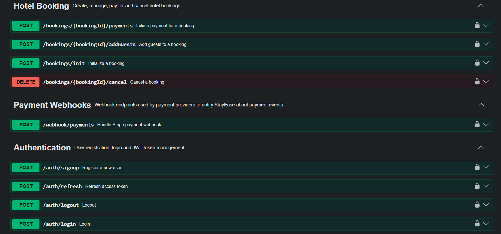
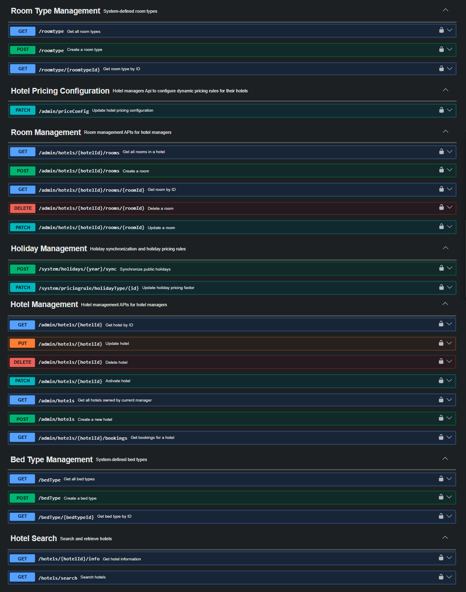

# StayEase — Hotel Booking Platform

> A production-oriented hotel booking backend built with **Java 21, Spring Boot, PostgreSQL, Docker, and GCP**, with JWT authentication, concurrency-safe room inventory, dynamic pricing, Stripe payments, CI/CD, centralized logging, and infrastructure monitoring.

[](#tech-stack)
[](#tech-stack)
[](#tech-stack)
[](#deployment)
[](#deployment)


---

## 📌 Project Overview

**StayEase** is a hotel booking platform designed as a production-oriented Spring Boot backend.

The system covers the complete hotel-booking lifecycle: authentication, hotel and room management, availability search, inventory management, dynamic pricing, booking creation, guest details, payment processing, scheduled background jobs, logging, monitoring, and cloud deployment.

The project was built not only as a REST API but as an end-to-end backend system with attention to **transaction management, concurrency, idempotent payment handling, observability, containerization, CI/CD, and deployment reliability**.

---

## 🚀 Engineering Highlights

- Built REST APIs using **Spring Boot and Java 21**.
- Implemented **JWT-based authentication** with access and refresh tokens.
- Added **role-based authorization** for `GUEST`, `HOTEL_MANAGER`, and `SYSTEM_ADMIN`.
- Implemented concurrent-safe room inventory using **database pessimistic locking** to protect against overbooking.
- Designed a multi-stage booking lifecycle:
  `RESERVED → ADDING_GUESTS → PAYMENT_PENDING → APPROVED`.
- Built a composable **dynamic pricing engine** using surge, occupancy, urgency, weekend, and holiday factors.
- Integrated **Stripe** payment processing with webhook handling and background reconciliation.
- Added scheduled processing for booking expiration, payment reconciliation, and pricing updates.
- Added structured application logging for booking, pricing, and scheduled-job workflows.
- Centralized application logs using **Grafana Alloy + Loki + Grafana**.
- Added VM infrastructure monitoring using **Prometheus + Node Exporter + Grafana**.
- Containerized the application infrastructure using **Docker Compose**.
- Deployed the application to a **GCP Compute Engine VM**.
- Implemented **GitHub Actions CI/CD** for Docker image versioning, publishing, deployment, health checks, and rollback validation.
- Used **Apache JMeter** to test authenticated booking workflows and concurrent booking scenarios.

---

## 🏗️ Architecture

### Application Architecture

```text
                    ┌──────────────────┐
                    │      Client      │
                    └────────┬─────────┘
                             │
                             ▼
                  ┌─────────────────────┐
                  │ Spring Boot REST API│
                  └──────────┬──────────┘
                             │
        ┌────────────────────┼────────────────────┐
        ▼                    ▼                    ▼
 Authentication       Hotel/Search          Booking/Inventory
 & Authorization      & Pricing             Payment/Refund
        │                    │                    │
        └────────────────────┼────────────────────┘
                             ▼
                       PostgreSQL
                             │
                    ┌────────┴────────┐
                    ▼                 ▼
                  Stripe          Calendarific
```

### Observability Architecture

```text
Application Logs
      │
      ▼
┌──────────────┐
│ Grafana Alloy │
└──────┬───────┘
       │
       ▼
┌──────────────┐
│     Loki     │
└──────┬───────┘
       │
       ▼
┌──────────────┐
│   Grafana    │
└──────────────┘


GCP VM
  │
  ▼
┌──────────────┐
│ Node Exporter│
└──────┬───────┘
       │
       ▼
┌──────────────┐
│  Prometheus  │
└──────┬───────┘
       │
       ▼
┌──────────────┐
│   Grafana    │
└──────────────┘
```

---

## 🔐 Authentication & Authorization

StayEase uses JWT-based authentication with:

- Access tokens
- Refresh tokens
- HTTP-only refresh-token cookie
- Role-based authorization

### Roles

| Role | Responsibility |
|---|---|
| `GUEST` | Search hotels, manage bookings, and use guest functionality |
| `HOTEL_MANAGER` | Manage hotels, rooms, inventory, and pricing configuration |
| `SYSTEM_ADMIN` | Administrative operations and elevated management |

Public signup creates a `GUEST`. Elevated roles are managed through protected administrative workflows.

---

## 🏨 Hotel & Room Management

Hotel managers can manage hotel inventory and room information.

The domain model includes:

- Hotels
- Rooms
- Room types
- Bed types
- Daily inventory
- Room pricing
- Hotel minimum pricing
- Pricing configuration

Room inventory tracks values such as:

```text
Total Inventory
Booked
Reserved
Price
Dynamic Price
Surge Factor
Closed
```

---

## 🔎 Hotel Search & Availability

The search workflow supports:

- Hotel availability
- Room availability
- Date-range searching
- Pricing information
- Minimum-price based search optimization

Dynamic pricing is applied for stays within the configured pricing horizon, while longer-range searches can use base pricing.

---

## 🔒 Concurrent Booking & Inventory Management

One of the key backend engineering challenges in StayEase is preventing **overbooking when multiple users attempt to reserve the same inventory simultaneously**.

The booking initialization flow uses a **database pessimistic write lock** on the relevant inventory records.

```text
Request A ─────┐
Request B ─────┼──► Inventory Record
Request C ─────┘          │
                          ▼
                   Pessimistic Lock
                          │
                          ▼
                  Check Availability
                          │
                          ▼
                  Reserve Inventory
                          │
                          ▼
                    Create Booking
```

This makes inventory updates concurrency-safe at the database transaction level.

---

## 📅 Booking Lifecycle

A booking progresses through multiple states:

```text
RESERVED
    │
    ▼
ADDING_GUESTS
    │
    ▼
PAYMENT_PENDING
    │
    ▼
APPROVED
```

The system also handles expiration and failure scenarios through scheduled background processing.

---

## 💰 Dynamic Pricing Engine

StayEase implements a composable pricing engine that calculates room prices using multiple factors.

### Pricing factors

- Base price
- Surge pricing
- Occupancy
- Booking urgency
- Weekend pricing
- Holiday pricing
- Hotel minimum price

Conceptually:

```text
Base Price
    │
    ▼
Surge Pricing
    │
    ▼
Occupancy Pricing
    │
    ▼
Urgency Pricing
    │
    ▼
Weekend Pricing
    │
    ▼
Holiday Pricing
    │
    ▼
Final Room Price
```

The pricing design uses composable strategy/decorator-style components so individual pricing rules can be combined without tightly coupling the complete pricing calculation.

Holiday information is obtained through **Calendarific**, with holiday categories used to determine the applicable pricing factor.

Pricing configuration changes can trigger a pricing refresh so affected inventory reflects the updated configuration.

---

## 💳 Payment Processing, Cancellation & Refunds

StayEase integrates **Stripe** for payment processing.

The payment workflow is designed to handle repeated payment attempts and asynchronous payment confirmation.

Key behaviors include:

- Reusing open/unpaid checkout sessions when appropriate.
- Creating a new payment attempt when an earlier session has expired.
- Tracking payment attempts using an attempt number.
- Confirming successful payments through Stripe events.
- Handling webhook processing.
- Running background reconciliation for pending payments.
- Marking expired payment attempts as failed rather than automatically creating uncontrolled retries.

```text
Booking
   │
   ▼
PAYMENT_PENDING
   │
   ├──────────────► Stripe Checkout
   │                       │
   │                       ▼
   │                 Stripe Webhook
   │                       │
   ▼                       ▼
Payment Reconciliation ─► APPROVED
```

---


### Booking cancellation and refunds

Users can cancel eligible bookings through the booking cancellation workflow. When a paid booking is cancelled and a refund is applicable, StayEase initiates the corresponding Stripe refund and updates the booking/payment state.

```text
Approved Booking
       │
       ▼
Cancellation Request
       │
       ▼
Refund Eligibility
       │
       ▼
Stripe Refund
       │
       ▼
Booking / Payment Updated
```

## ⏱️ Scheduled Background Processing

StayEase uses scheduled services for background processing.

Examples include:

- Expiring time-limited bookings.
- Reconciling pending payments.
- Refreshing and updating dynamic pricing.
- Updating inventory pricing based on configured rules.

This reduces the need to depend on a user request to complete time-based system operations.

---

## 📊 Observability & Monitoring

StayEase includes two complementary observability pipelines.

### Application Logging

Application logs are written for key areas including:

- Booking
- Dynamic pricing
- Scheduled jobs

The logging pipeline is:

```text
Spring Boot
    │
    ▼
Log Files
    │
    ▼
Grafana Alloy
    │
    ▼
Loki
    │
    ▼
Grafana
```

Grafana dashboards can be used to investigate booking activity, pricing activity, scheduled jobs, and application errors.

### Application Logs

The application logging dashboard can be used to investigate booking,
pricing, scheduled-job activity, and application errors.



### VM Monitoring

Infrastructure metrics are collected using:

```text
GCP VM
   │
   ▼
Node Exporter
   │
   ▼
Prometheus
   │
   ▼
Grafana
```

Current VM monitoring includes:

- CPU utilization
- Memory utilization
- Disk utilization
- System load
- VM uptime



Prometheus uses a 1-minute scrape interval for the VM metrics.


---

## 🐳 Docker & Deployment

The application and supporting infrastructure are containerized using Docker Compose.

### Main containers

| Service | Purpose |
|---|---|
| `stayease-app` | Spring Boot REST API |
| `stayease-postgres` | PostgreSQL database |
| `stayease-loki` | Centralized log storage |
| `stayease-alloy` | Log collection and forwarding |
| `stayease-grafana` | Observability dashboards |
| `stayease-prometheus` | VM metrics collection |

**Node Exporter** runs directly on the VM as a systemd service because it collects host-level operating-system metrics.

---

## ☁️ Cloud Deployment

The application is deployed to a **GCP Compute Engine VM** running Ubuntu.

The VM runs the Dockerized StayEase application and observability stack.

```text
                    GCP Compute Engine
                           │
             ┌─────────────┼─────────────┐
             │             │             │
             ▼             ▼             ▼
        Spring Boot    PostgreSQL    Observability
          Docker         Docker        Stack
                                        │
                             ┌──────────┴──────────┐
                             ▼                     ▼
                           Loki                 Grafana
                             ▲                     ▲
                             │                     │
                           Alloy              Prometheus
                                                   ▲
                                                   │
                                            Node Exporter
```

---

## 🔄 CI/CD Pipeline

GitHub Actions automates the application image build and deployment process.

### Deployment flow

```text
Developer
    │
    │ git push
    ▼
GitHub
    │
    ▼
GitHub Actions
    │
    ├── Checkout source
    ├── Determine application version
    ├── Build Docker image
    ├── Push image to Docker Hub
    │
    ▼
Self-hosted GitHub Actions Runner
    │
    ▼
deploy.sh
    │
    ├── Pull new Docker image
    ├── Update application version
    ├── Recreate application container
    ├── Run health check
    ├── Verify running image
    └── Roll back when deployment validation fails
```

The deployment script validates the application through the health endpoint before considering a deployment successful.

This provides a basic deployment safety mechanism rather than simply replacing the running container.

---

## 🧪 Testing & Performance

The project uses automated application tests and **Apache JMeter** for workflow/load testing.

### JMeter scenarios

The booking workflow can be exercised through:

```text
Login
  ↓
JWT Authentication
  ↓
Initialize Booking
  ↓
Add Guests
  ↓
Initiate Payment
```

Concurrency testing also targets scenarios where multiple authenticated users attempt to book the same hotel, room, and date.

This was used to validate:

- Authentication under load
- Booking workflow reliability
- Inventory locking
- Sold-out behavior
- Concurrent booking handling

---

## 🛠️ Tech Stack

### Backend

- Java 21
- Spring Boot
- Spring MVC
- Spring Data JPA
- Hibernate
- Spring Security
- JWT
- Maven

### Database

- PostgreSQL

### Payments & External Services

- Stripe
- Calendarific

### Containerization

- Docker
- Docker Compose

### Cloud

- Google Cloud Platform
- Compute Engine
- Ubuntu

### CI/CD

- GitHub Actions
- Self-hosted GitHub Actions Runner
- Docker Hub

### Observability

- Grafana
- Loki
- Grafana Alloy
- Prometheus
- Node Exporter

### Testing

- JUnit
- Mockito
- Apache JMeter

### API Documentation

StayEase exposes REST APIs for authentication, hotel management,
room management, inventory, search, bookings, payments, pricing,
and administrative operations.

The APIs are documented using **OpenAPI 3** and can be explored
interactively through Swagger UI.

### Swagger UI

#### Booking, Authentication & Payment APIs



#### Hotel Management, Search & Pricing APIs




The API documentation includes:

- JWT authentication and token management
- Hotel and room management
- Hotel search and availability
- Booking initialization and guest management
- Payment initiation
- Booking cancellation
- Stripe payment webhooks
- System and Administrative APIs
- Dynamic pricing APIs

**Local:**

```
http://35.207.225.59/api/v1/swagger-ui/index.html
```

**Deployed:**

```text
http://<VM_PUBLIC_IP>:8080/api/v1/swagger-ui/index.html
```


---

## 📁 Project Structure

A simplified structure is:

```text
stayEase/
├── src/
│   ├── main/
│   │   ├── java/
│   │   │   └── com/project/stayEase/
│   │   │       ├── auth/
│   │   │       ├── booking/
│   │   │       ├── hotel/
│   │   │       ├── room/
│   │   │       ├── inventory/
│   │   │       ├── payment/
│   │   │       ├── pricing/
│   │   │       ├── scheduler/
│   │   │       └── ...
│   │   └── resources/
│   │       └── application*.yml
│   │
│   └── test/
│
├── Dockerfile
├── docker-compose.yml
├── deploy.sh
├── pom.xml
└── README.md
```

> The exact package structure may evolve as the project grows.

---

## 🚀 Running Locally

### Prerequisites

Install:

- Java 21
- Maven
- Docker
- Docker Compose

### Clone the repository

```bash
git clone <YOUR_GITHUB_REPOSITORY_URL>
cd stayEase
```

### Configure environment variables

Create your local environment configuration using the variables required by the application.

Do **not** commit secrets such as:

- JWT signing keys
- Database passwords
- Stripe secret keys
- Stripe webhook secrets
- Calendarific API keys

Example:

```env
POSTGRES_DB=stayEaseDb
POSTGRES_USERNAME=<your-username>
POSTGRES_PASSWORD=<your-password>

JWT_SECRET_KEY=<your-secret>
JWT_ACCESS_TOKEN_EXPIRATION=<value>
JWT_REFRESH_TOKEN_EXPIRATION=<value>

STRIPE_SECRET_KEY=<your-secret>
STRIPE_WEBHOOK_SECRET=<your-secret>

CALENDAR_API_KEY=<your-key>
```

### Start PostgreSQL

```bash
docker compose up -d postgres
```

### Run the application

```bash
./mvnw spring-boot:run
```

On Windows:

```powershell
.\mvnw.cmd spring-boot:run
```

---

## 🔑 Environment Variables

The repository should include a safe `.env.example` containing variable names and placeholder values. Real secrets must remain outside Git.

Example:

```env
POSTGRES_DB=stayEaseDb
POSTGRES_USERNAME=<your-db-username>
POSTGRES_PASSWORD=<your-db-password>
DB_URL=jdbc:postgresql://localhost:5433/stayEaseDb
JWT_SECRET_KEY=<generate-a-secure-secret>
JWT_ACCESS_TOKEN_EXPIRATION=<value>
JWT_REFRESH_TOKEN_EXPIRATION=<value>
STRIPE_SECRET_KEY=<stripe-secret-key>
STRIPE_WEBHOOK_SECRET=<stripe-webhook-secret>
CALENDAR_API_KEY=<calendarific-api-key>
FRONTEND_URL=http://localhost:4200
```

**Do not put real secrets in the README.** Use placeholders only. Keep `.env`, local configuration files, API keys, signing keys, database passwords, and payment credentials out of source control.

---

## 📡 API Overview

The REST API is organized around the major business capabilities of the platform.

| Area | Responsibilities |
|---|---|
| Authentication | Signup, login, token refresh, authorization |
| Hotels | Hotel management and retrieval |
| Rooms | Room and room-type management |
| Inventory | Daily room availability and inventory |
| Search | Hotel and room availability search |
| Pricing | Pricing configuration and dynamic pricing |
| Bookings | Booking lifecycle and guest information |
| Payments | Stripe payment workflow and reconciliation |
| Administration | System-level management |

Interactive API documentation is available through **Swagger/OpenAPI** when the application is running.

---

## 🔒 Security Notes

Secrets are supplied through environment variables rather than being committed to source control.

Production credentials and infrastructure secrets should never be placed in:

- `application.yml`
- Docker Compose files
- GitHub Actions source
- README documentation
- Docker images

---

## 📈 Why This Project?

StayEase was designed to go beyond a basic CRUD application.

The project focuses on backend engineering problems that occur in real systems:

- How do you prevent overbooking under concurrent requests?
- How do you safely manage a multi-stage booking workflow?
- How do you handle asynchronous payment confirmation?
- How do you reconcile incomplete payment states?
- How do you calculate prices from multiple independent rules?
- How do you process time-based operations automatically?
- How do you collect and investigate application logs?
- How do you monitor infrastructure?
- How do you deploy a new application version safely?

These concerns shaped the architecture and implementation of the project.

---

## 🔮 Future Improvements

Potential future improvements include:

- Production HTTPS/domain configuration
- Expanded integration and end-to-end testing
- More advanced infrastructure alerting and notification integrations
- Further scalability and resilience improvements

---

## 👨‍💻 Author

**Varun Jain**

Associate Software Engineer | Backend Development | Java | Spring Boot

The StayEase project was built as a practical demonstration of backend development, database design, cloud deployment, containerization, CI/CD, and observability.

---

## ⭐ Project Focus

```text
Java + Spring Boot
        +
PostgreSQL
        +
Concurrency-safe Booking
        +
Dynamic Pricing
        +
Stripe Payments
        +
Docker
        +
GCP
        +
GitHub Actions
        +
Grafana / Loki / Alloy
        +
Prometheus / Node Exporter
        +
JMeter
```

**StayEase is designed as a complete backend system rather than only a collection of REST CRUD endpoints.**
